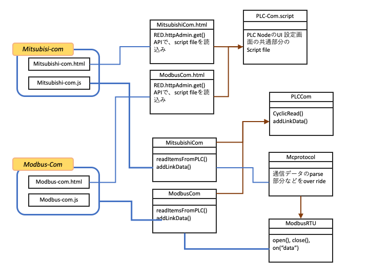

# PLC通信ノード

## Modbus-com, Mitsubishi-com

## 機能概要
PLC-Modbus NodeやPLC-Modbus-AE Node、PLC-Mitsubishi NodeやPLC-Mitsubishi-AE Nodeから登録される、Modbus機器との通信情報を保持するリンクオブジェクト(linkObj)から、PLC通信のデバイスアドレステーブルを作成し、定期的にPLCと通信を実行、データを取得してlinkObjを更新する設定Node。  
linkObjには、通信で取得すべきPLC機器のデバイス種別、デバイスアドレス、取得したデータの値、前回のデータの値、このリンクデータを使用するNodeのID,このデータから生成されるia-cloudオブジェクトのobjectKeyが格納される。詳細は、後述のリンクオブジェクト構造を参照のこと。

## 入力メッセージ
なし  

## 出力メッセージ
なし

## 全体のモジュール構成

Modbus-Com と　Mitsubishi-Comを構成するモジュール構造を下図に示す。



Modbus-Com と　Mitsubishi-Comの両設定Nodeは、機能的にほぼ同じであるので、UI画面のスクリプト共通部分は、  
* PLC-Com.script.js  

ととしてモジュール化し、実行部分のjsの共通部分は、  
* PLC-Com.js  

にクラス化した。
Modbusの通信実行モジュールは、Node.jsのmodbus-serialモジュールクラス郡をrequireして使用している。またこのクラス群を拡張して、三菱MCプロトコールモジュールを実装した。実装済みの機能は、  
* TCP通信４Eフレーム、バイナリーコード
* シリアル通信形式４、３Cフレーム
* シリアル通信形式５、４Cフレーム、バイナリー  

の３方式で、使用しているコマンドは  
* ビット連続読み出し、
* ワード連続読み出し  

の2種のみである。


## PLC Nodeとのイベント交換

* addLinkData イベントの受信  
PLC Nodeが発行するaddLinkDataイベントを受信する。イベントの引数はlinkObjをである。
xxx-com nodeは、新たなaddLinkDataイベント受信後の周期PLC通信実行時に、linkObjをスキャンしPLC通信でアクセスすべきアドレスのデバイス毎のテーブルを作成する。この作業は重複を削除し、昇順にソートする。
ソートされたテーブルをから。連続領域で読出しできる範囲を決定し、連続読出しの通信パラメータを設定し通信を実施、データ値を取得して、linkDataを更新する。

* changListener イベントの発行
PLC通信Nodeは、毎周期のPLC通信実施後、その通信結果に基づき取得したデータで、LinkObjを更新し、取得したデータに変化があった場合(value != preValue)は、linDataに登録されているNode IDを使い登録元のNodeのエベントemit("addLinkData")を発行しする。

## プロパティー

各PLC通信nodeのプロパティとその説明は、各Nodeのhelpファイルを参照のこと。

#### リンクオブジェクト(linkObj)：

各PLC NodeやPLC-AE Nodeは、このlinkObjをPLC通信Nodeにイベント通知することで、取得するPLCデータを登録できる。各PLC通信Nodeは、各PLC Nodeなどから登録されたLinkObjを統合し、重複を削除しソートを行い、効率的な通信単位に分割して、PLC通信を実施しLinkObjのデータを更新する。  
また、受信したデータに変化があった場合は、そのLinkObjを登録したNodeのChangeListnerイベントを発行し通知する。  
LinkObjのエントリーは、各PLC機種に依存しする。下記は、Modebus とPLC三菱シーケンサの例である。  
使用しないPLCメモリデバイスのエントリーは存在しなくてもかまわない。
通信ステータスを取得するため、linkObjにerrorのエントリーが必ず存在する。

```
{error:[errorData], Coil:[linkData,], IS:[linkData], IR:[linkData,], HR:[linkData,]}

{error:[errorData],M:[linkData,], X:[linkData], Y:[linkData,], L:[linkData,], SM:[linkData,], D:[linkData,], W:[linkData,]}
```
リンクデータ(linkData)  
複数のNodeやia-cloudオブジェクトから参照されるデバイスアドレスは、linkDataも複数存在する。

```
{
    address: 0,       // Modbusデバイスアドレス
    value: "",        // 通信で取得された値(bitデバイス："0"/"1"、ワードデバイス："0xoooo"16ビットのHex表現文字列)
    preValue: "",     // 1回前の取得データ
    nodeId: null,     // このリンクデータを利用するNodeのID
    objectKey: ""     // このリンクデータを利用するia-cloudオブジェクトのobjectKey
}
```
エラーステータスのリンクデータ(linkData)   
```
{
    address: 0,       // 未使用
    value: "",        // 通信のエラーステータス（"ok"ないしは、errorオブジェクトのメッセージ）
    preValue: "",     // 1回前の通信のエラーステータス
    nodeId: null,     // このリンクデータを利用するNodeのID
    objectKey: ""     // このリンクデータを利用するia-cloudオブジェクトのobjectKey
}
```

## データ変化時のchangelistener呼び出し  
Modebus通信で取得したデータに変化があった場合、そのデータを参照しているia-cloudオブジェクトを持つNodeのchangeListenerメソッドを、そのobjectKeyの配列を引数に呼び出す。
そのため内部では、変化時の通知設定があり（NodeIDとobjectKeyが登録）Modbus通信で取得したデータに変化があった場合、コールバックすべきNodeIDと引数としてとるべきobjectKeyを格納した以下のlistenersオブジェクトを使っている。
```
{
    "eff4e65d.c42b08": ["ojectKey", .... ], // 各node毎でデータを使用するobjectKey配列
    "d2d4b097.7458a": ["ojectKey", .... ], // 各node毎でデータを使用するobjectKey配列
              .
              .
              .
              .
}
```
