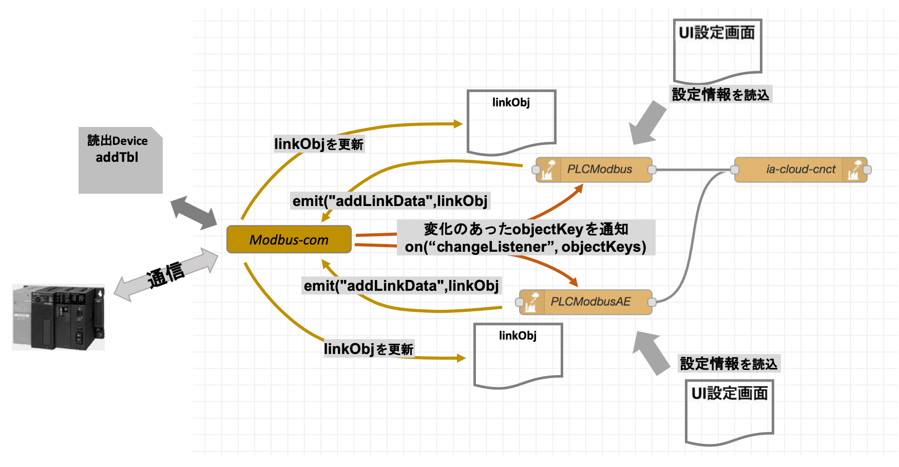

# PLC通信機器関連ノード

## PLC-modbus、PLC-modbus-AE、PLC-mitsubishi、PLC-Mitsubishi-AE
## Modbus-com、Mitsubishi-com

## 機能概要
これら一連のノードは、Modbus通信や三菱MCプロトコール通信を備えた各種の計測制御機器と通信を行い、それらの機器が保持するデータを読み出して、ia-cloud Center Server（CCS）へ格納するオブジェクトを生成して出力メッセージとして送出する。  
以下に、Modbus通信PLCを例にPLC Nodeと通信Nodeの、相互のメソッドコールとイベントリスナー登録・イベント発生の関連を示す。



#### PLC-Modbus, PLC-Mitsubishi  
PLCの持つビットデータ・ワードデータを読み出し、ia-cloudオブジェクトを生成するNode。  
PLC-Modbus NodeのcontentDataを設定する設定Node。ビット列、数値、文字列、数値列の自由な組み合わせでcontentDataを構成する設定が可能。
#### PLC-Modbus-AE, PLC-Mitsubishi-AE
PLCの持つビットデータを読み出し、アラーム＆イベント情報を持つia-cloudオブジェクトを生成するNode。
複数のcontentType="Alarm&Event"を持つcontentDataを設定できる。
#### Modbus-com, Mitsubishi-com
登録されたlinkObj（デバイスアドレスとデータ値等を保持する）から、Modbus通信のデバイスアドレステーブルを作成し、定期的にPLCとの通信を実行、データを取得してlinkObjを更新する設定Node。取得データに変化のあった場合に、登録されたchangeイベントを発行しリスナーを起動する。

### Node間のI/Fで使用されるオブジェクト　　

#### 設定オブジェクト：  
PLC-Modbus、PLC-Modbus-AEの設定情報を保持するオブジェクト。
```
{
  objectKey: "ユニークなオブジェクトキー",
  objectType: "iaCloudObject",        // 固定
  objectDescription: "オブジェクトの説明",
  storeInterval: 60,
  storeAsync: true,   // オブジェクトのオプション
  dataItems: [{
    dataName: "データ名称",
                          //DataItemオプション
      itemType: "bit",
      deviceType: "Coil",
      source:123,
      number: 1,
      logic: "pos"

  }
}
```
ia-cloudオブジェクトの設定オプション
```
dataObjects[i].options = {
  storeInterval: 60,    // 定期収集周期（秒）最小値10秒
  storeAsync: true      // データ変化時の非同期収集の有無
  }
```
データアイテムの設定オプション(bit列)
```
dataObjects[i].ObjectContent.contentData[i].options = {
    itemType: "bit",      // 取得するデータの種別、bit(ビット列)
    deviceType: "Coil",   // 取得するビットデータ列のあるデバイス種別（Coil/IS）
    source:123,           // 取得するビットデータ列の先頭デバイスアドレス
    number: 1,            // 取得するビットデータ列のビット数
    logic: "pos"          // 取得するビットデータの論理（pos:1がtrue/neg:0がtrue）
  }
```
データアイテムの設定オプション(number)
```
dataObjects[i].ObjectContent.contentData[i].options = {
    itemType: "number",   // 取得するデータの種別、number(数値)
    deviceType: "IR",     // 取得するデータのあるデバイス種別（HR/IR）
    source:213,           // 取得するデータのあるデバイスアドレス
    type: "1w",           // 取得するデータの種別（1w:ワード、2w_b:ダブルワードビッグエンディアン、2w-l:ダブルワードリトルエンディアン）
    encode: "unsigned",   // 取得するデータの形式(unsigned:符号なし、signed:符号付、BCD:2進化10進)
    offset: 0,            // 取得するデータのゼロ点オフセット
    gain: 1               // 取得するデータの倍率
  }
```
データアイテムの設定オプション(string)
```
dataObjects[i].ObjectContent.contentData[i].options = {
    itemType: "string",   // 取得するデータの種別、string(文字列)
    deviceType: "IR",     // 取得する文字列のあるデバイス種別（HR/IR）
    source:123,           // 取得する文字列の先頭デバイスアドレス
    number: 1,            // 取得する文字列のワード数（文字数では無い、連続ワードデバイスの数）
    encode: "utf-8"       // 取得する文字列のエンコード（utf-8/sJIS/EUC）
  }
```
データアイテムの設定オプション(numList)
```
dataObjects[i].ObjectContent.contentData[i].options = {
    itemType: "numList",  // 取得するデータの種別、numList(数値列)
    deviceType: "HR",     // 取得するデータのあるデバイス種別（HR/IR）
    source:213,           // 取得するデータのあるデバイスアドレス
    number: 1,            // 取得するデータ列の数（ワード数では無い、連続データの数）
    type: "1w",           // 取得するデータの種別（1w:ワード、2w_b:ダブルワードビッグエンディアン、2w-l:ダブルワードリトルエンディアン）
    encode: "unsigned",   // 取得するデータの形式(unsigned:符号なし、signed:符号付、BCD:2進化10進)
  }
```
#### リンクオブジェクト(linkObj)：
```
{Coil:[linkData,], IS:[linkData], IR:[linkData,], HR:[linkData,]}
```
リンクデータ(linkData)  
複数のNodeやia-cloudオブジェクトから参照されるデバイスアドレスは、linkDataも複数存在する。
```
{
    address: 0,       // Modbusデバイスアドレス
    value: "",        // 通信で取得された値(bitデバイス："0"/"1"、ワードデバイス："0xoooo"16ビットのHex表現文字列)
    preValue: "",     // 1回前の取得データ
    nodeId: null,     // このリンクデータを利用するNodeのID
    objectKey: ""     // このリンクデータを利用するia-cloudオブジェクトのobjectKey
}
```
